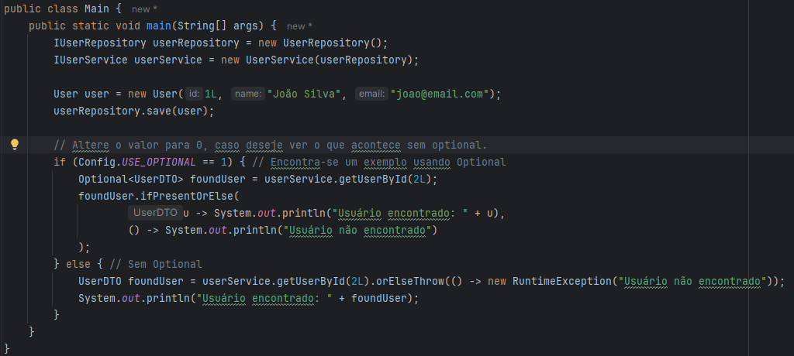
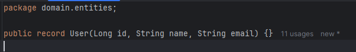

# Aplicando Optional, Record e SOLID em Java
Este projeto tem como objetivo explorar o uso do Optional para evitar null, utilizar record para representar dados de forma imutável e aplicar os princípios do SOLID para um código bem estruturado e de fácil manutenção.

# Índice
1. [Conceitos abordados](#conceitos-abordados)
2. [Explicação da Estrutura](#explicação-da-estrutura)
3. [Benefícios dessa Estrutura](#benefícios-dessa-estrutura)
4. [Sobre o Optional](#sobre-o-optional)
5. [Sobre o Record](#sobre-o-record)
6. [Tecnologias utilizadas](#tecnologias-utilizadas)

## Conceitos abordados
- Uso de `Optional` para tratamento seguro de valores ausentes

- Implementação de `record` para modelagem de dados

- Aplicação dos princípios `SOLID` para melhorar a organização do código

## Explicação da Estrutura
`application/` → Camada de aplicação.

- `services/` → Contém a implementação dos serviços da aplicação (UserService.java).

`domain/` → Camada de domínio.

- `entities/` → Define as entidades (User.java, UserDTO.java).

- `repositories/` → Define a interface e implementação do repositório.

- `services/` → Define as interfaces dos serviços (IUserService.java).

`infrastructure/` → Camada para infraestrutura (configurações do projeto).

`main/` → Ponto de entrada do programa (Main.java).

## Benefícios dessa Estrutura
✅ Organização clara entre aplicação, domínio e infraestrutura. 
✅ Fácil escalabilidade (permite adicionar mais funcionalidades sem bagunçar o código). 
✅ Aderência ao padrão DDD (Domain-Driven Design).

## Sobre o Optional
✅ Vantagens:
1. Evita exceções indesejadas (`NullPointerException`).

2. Código mais expressivo → já indica que o retorno pode ser vazio.

3. Melhora a legibilidade e obriga o desenvolvedor a lidar com a ausência do dado, ou seja, menos bugs.

Encontra-se um exemplo no arquivo: `src/main/Main.java`

## Sobre o Record
Os records são uma novidade introduzida no Java 14, que proporcionam uma forma mais concisa e eficiente de criar classes imutáveis com um comportamento simplificado.
 

**Usar `record` quando:**
- O objeto é imutável.

- O foco é em dados simples e acesso a esses dados.

- Você não precisa de herança ou de comportamentos complexos.

- O objetivo é criar uma classe de valor (DTO, entidades simples).

**Evitar `record` quando:**
- O objeto precisa ser mutável.

- Você precisa de herança ou polimorfismo.

- O comportamento dentro da classe é complexo e envolve lógica de negócios extensa.

- A classe vai passar por mudanças frequentes em sua estrutura de dados.

Encontra-se um exemplo no arquivo: `src/domain/entities/User.java` e `src/domain/entities/UserDTO.java` 

**Conclusão:**  
O `record` é ideal para quando você precisa de uma maneira simples e eficiente de representar dados imutáveis. Porém, ele não serve para todos os cenários e, por isso, é importante avaliar a complexidade e os requisitos do seu sistema antes de decidir utilizá-lo.

## Tecnologias utilizadas
- **Java** (versão 21.0.5)